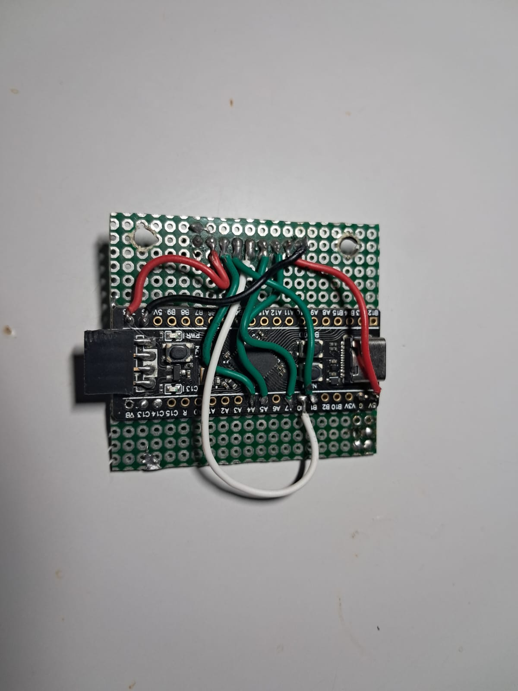

# HomeLab Monitor

Real-time server monitoring system with a CRT amber-style TFT display. Displays system statistics on a 320x240 screen connected to an STM32 microcontroller (BlackPill F411CE).

## Table of Contents

- [About](#about)
- [Gallery](#gallery)
- [Hardware](#hardware)
- [Project Structure](#project-structure)
- [Installation](#installation)
- [Configuration](#configuration)
- [Usage](#usage)
- [Protocol](#protocol)
- [License](#license)

## About

This project consists of two main components:

1. **Firmware**: Code for the STM32 microcontroller that drives the TFT display
2. **Server Client**: Python script that collects server metrics and sends them to the display

### Monitored Metrics

- Server IP address
- System uptime
- Load Average (1, 5, 15 min)
- CPU usage with temperature
- RAM and Swap usage
- Disk usage
- Network traffic (RX/TX)
- Disk I/O (read/write)
- Process count
- SMB/Samba connected clients
- Active TCP connections

## Gallery

Add photos of your project to the docs/images/ folder and update the references below.

| Description | Image |
|-------------|-------|
| Display running |  |
| Wiring |  |
## Hardware

### Components

| Component | Specification |
|-----------|---------------|
| Microcontroller | STM32F411CE (BlackPill) |
| Display | TFT 2.4" 320x240 ST7789 |
| Programmer | ST-Link V2 |
| Connection | USB (CDC Serial) |

### SPI Pinout

| Display | STM32 |
|---------|-------|
| MOSI | PA7 |
| SCLK | PA5 |
| CS | PA4 |
| DC | PB1 |
| RST | PB0 |
| VCC | 3.3V |
| GND | GND |

## Project Structure

```
homelab-monitor/
├── README.md
├── LICENSE
├── .gitignore
├── firmware/
│   ├── platformio.ini
│   ├── src/
│   │   └── main.cpp
│   ├── include/
│   ├── lib/
│   │   └── TFT_eSPI_Config/
│   │       └── User_Setup.h
│   └── test/
├── server-client/
│   ├── requirements.txt
│   ├── pyproject.toml
│   ├── src/
│   │   ├── __init__.py
│   │   └── monitor.py
│   ├── config/
│   │   └── config.example.yaml
│   └── tests/
│       └── test_serial.py
├── docs/
│   ├── HARDWARE.md
│   ├── PROTOCOL.md
│   └── images/
└── scripts/
    └── install.sh
```

## Installation

### Firmware

Prerequisites:
- PlatformIO IDE or CLI
- ST-Link V2

```bash
cd firmware
pio run -t upload
```

### Server Client

Prerequisites:
- Python 3.10+
- Serial port access

```bash
cd server-client
pip install -r requirements.txt
```

## Usage

### Manual Execution

```bash
cd server-client
python src/monitor.py /dev/ttyACM0
```

Available options:
- -b, --baud: Baud rate (default: 115200)
- -i, --interval: Update interval in seconds (default: 2)

### Running as a Service

```bash
sudo cp scripts/homelab-monitor.service /etc/systemd/system/
sudo systemctl daemon-reload
sudo systemctl enable homelab-monitor
sudo systemctl start homelab-monitor
```

## Protocol

Serial communication using key=value format, ending with END:

```
ip=192.168.1.100
up=5d 12h 30m
cpu_pct=45
cpu_temp=52
ram_pct=67
END
```

See docs/PROTOCOL.md for complete details.

## License

MIT License - see [LICENSE](LICENSE) for details.
